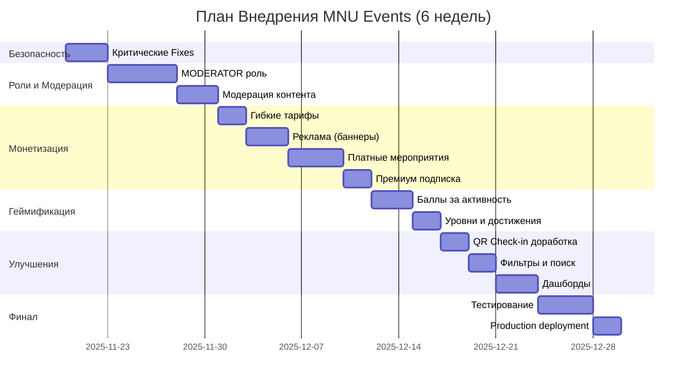
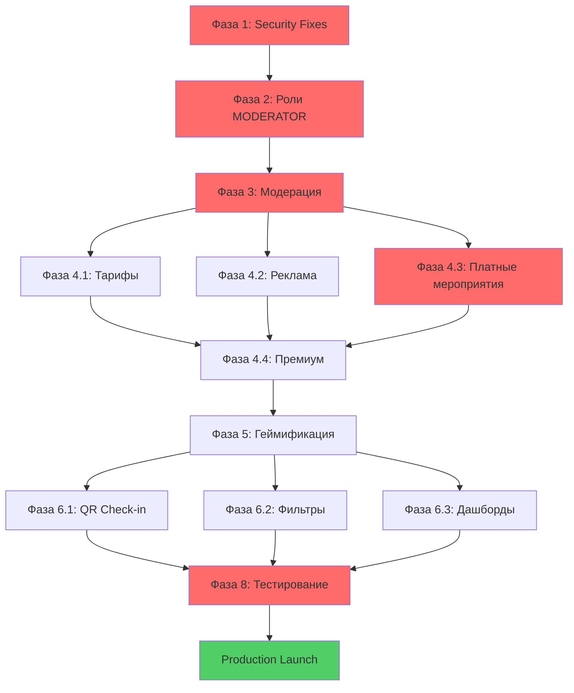

# 📋 План Внедрения MNU Events Platform

**Версия:** 1.0  
**Дата создания:** 2025-11-19  
**Статус проекта:** 82% Complete (Grade C+) - НЕ готов к production  
**Команда:** 1 разработчик  
**Временные рамки:** 6 недель (1.5 месяца)  

---

## 📊 Executive Summary

### Текущее Состояние
Проект MNU Events находится на стадии feature-complete MVP с **критическими проблемами безопасности** и **отсутствующим функционалом монетизации**. Требуется комплексный подход к внедрению новых функций при минимальном устранении блокирующих уязвимостей.

### Ключевые Метрики
| Метрика | Текущее | Целевое (после плана) |
|---------|---------|----------------------|
| **Безопасность** | 4.5/10 (8 критических проблем) | 6.5/10 (3 критические решены) |
| **Функционал** | 82% (базовый MVP) | 95% (полный функционал) |
| **Монетизация** | 0% (mock payment) | 80% (ручная оплата + реклама) |
| **Роли** | 3 (STUDENT, ORGANIZER, ADMIN) | 4 (+MODERATOR) |
| **Production Ready** | ❌ НЕТ | ⚠️ УСЛОВНО (с ограничениями) |

### Стратегия Реализации
**Приоритет:** Запуск MVP с новым функционалом за 1.5 месяца, минимальные security fixes.

**Подход:**
1. ✅ Критические security fixes только те, что блокируют запуск (3 из 8)
2. ✅ Фокус на монетизации и новых ролях (MODERATOR)
3. ✅ Базовая геймификация без сложной логики
4. ⏳ Остальные security issues - после запуска MVP

### Основные Риски
| Риск | Вероятность | Влияние | Митигация |
|------|-------------|---------|-----------|
| Недостаточная безопасность для production | Высокая | Критическое | Ограниченный beta-запуск, мониторинг |
| Один разработчик - узкое место | Средняя | Высокое | Четкая приоритизация, отказ от nice-to-have |
| Интеграция с Kaspi API затянется | Средняя | Среднее | Ручная проверка платежей организатором |
| Геймификация слишком сложная | Низкая | Среднее | Минимальная версия (только баллы + уровни) |

---

## 🎯 Часть 1: Текущие Проблемы

### 1.1 Критические Проблемы Безопасности (8 проблем)

#### ✅ ИСПРАВЛЕНЫ (3 из 8)
1. ✅ **Hardcoded secrets** - ИСПРАВЛЕНО 2025-11-19
2. ✅ **Helmet и security headers** - ИСПРАВЛЕНО 2025-11-19  
3. ✅ **PAYMENT_SECRET в .env** - ДОБАВЛЕНО 2025-11-19

#### 🔴 ТРЕБУЮТ ИСПРАВЛЕНИЯ ДО ЗАПУСКА (3 проблемы)
4. **🔴 Webhook без аутентификации** [`backend/src/payments/payments.controller.ts:47`](backend/src/payments/payments.controller.ts:47)
   - **Impact:** Бесплатные билеты через поддельные webhook запросы
   - **Решение:** HMAC signature verification
   - **Приоритет:** HIGH (блокирует платные мероприятия)
   - **Время:** 4 часа

5. **🔴 IDOR в QR Scanner** [`backend/src/checkin/checkin.service.ts:48`](backend/src/checkin/checkin.service.ts:48)
   - **Impact:** Организатор может сканировать билеты чужих событий
   - **Решение:** Проверка ownership события
   - **Приоритет:** HIGH (блокирует check-in систему)
   - **Время:** 2 часа

6. **🔴 Race conditions в регистрациях** [`backend/src/registrations/registrations.service.ts:62`](backend/src/registrations/registrations.service.ts:62)
   - **Impact:** Переполнение capacity события
   - **Решение:** Транзакции с Serializable isolation level
   - **Приоритет:** MEDIUM (влияет на платные события)
   - **Время:** 3 часа

#### ⏳ ОТЛОЖЕНЫ НА ПОСЛЕ ЗАПУСКА (5 проблем)
7. ⏳ JWT токены в localStorage (XSS уязвимость) - **Фаза 8**
8. ⏳ CSRF защита - **Фаза 8**
9. ⏳ Mock payment в production - **Фаза 8** (после Kaspi API)
10. ⏳ XSS через user-generated content - **Фаза 8**
11. ⏳ Backend контейнеры под root - **Фаза 8**

### 1.2 Production Gaps (НЕ блокируют MVP)
- ⏳ Health check endpoints - **после запуска**
- ⏳ Logging service (Winston/Pino) - **после запуска**
- ⏳ Error tracking (Sentry) - **после запуска**
- ⏳ CI/CD pipeline - **после запуска**
- ⏳ Тестирование (<10% coverage) - **после запуска**

### 1.3 Технический Долг
| Проблема | Файл | Приоритет | Фаза |
|----------|------|-----------|------|
| Дублирование Check-In логики | `schema.prisma:120, 241` | Medium | Фаза 6 |
| Отсутствие Soft Deletes | `schema.prisma` | Low | После MVP |
| Console.log в production | `frontend/js/`, `backend/src/` | Low | После MVP |
| Нет input sanitization | `frontend/js/pages/` | Medium | Фаза 8 |

---

## 🚀 Часть 2: План Внедрения по Фазам

### Общая Временная Шкала (6 недель)



---

### 📍 Фаза 1: Критические Security Fixes (3 дня)
**Цель:** Устранить 3 блокирующие уязвимости  
**Время:** 18-24 часа работы  
**Приоритет:** КРИТИЧЕСКИЙ  

#### Задачи
- [ ] **1.1 Webhook Signature Verification** (4ч)
  - Добавить HMAC-SHA256 проверку подписи в webhook
  - Файл: [`backend/src/payments/payments.controller.ts`](backend/src/payments/payments.controller.ts:47)
  - Валидация через `PAYMENT_SECRET` из `.env`
  
- [ ] **1.2 IDOR Fix в QR Scanner** (2ч)
  - Проверка ownership события перед сканированием
  - Файл: [`backend/src/checkin/checkin.service.ts`](backend/src/checkin/checkin.service.ts:48)
  - Добавить authorization check
  
- [ ] **1.3 Race Conditions Fix** (3ч)
  - Транзакции с Serializable isolation
  - Файл: [`backend/src/registrations/registrations.service.ts`](backend/src/registrations/registrations.service.ts:62)
  - Atomic capacity check + registration

#### Критерии Завершения
- ✅ Webhook отклоняет запросы без валидной подписи
- ✅ QR сканирование работает только для своих событий
- ✅ Capacity события не переполняется при concurrent requests
- ✅ Все тесты проходят

---

### 📍 Фаза 2: Базовая Инфраструктура (2 дня)
**Цель:** Подготовить систему для новых ролей  
**Время:** 12-16 часов работы  
**Приоритет:** ВЫСОКИЙ  

#### Задачи
- [ ] **2.1 Расширить Role Enum** (1ч)
  - Добавить `MODERATOR` в [`backend/prisma/schema.prisma`](backend/prisma/schema.prisma:48)
  - Миграция: `npx prisma migrate dev --name add-moderator-role`
  
- [ ] **2.2 Authorization Guards** (3ч)
  - Создать `ModeratorGuard` для защиты модерационных эндпоинтов
  - Файл: `backend/src/common/guards/moderator.guard.ts`
  - Использовать в контроллерах
  
- [ ] **2.3 Frontend Constants** (1ч)
  - Добавить MODERATOR в [`frontend/js/utils/constants.js`](frontend/js/utils/constants.js)
  - Обновить UI для модераторов

#### Технические Детали
```typescript
// backend/prisma/schema.prisma
enum Role {
  STUDENT
**Цель:** Модерация объявлений и мероприятий  
**Время:** 32-40 часов работы  
**Приоритет:** ВЫСОКИЙ  

#### 3.1 Backend: Moderation Module (2 дня)

**Задачи:**
- [ ] **3.1.1 Модель ModerationQueue** (3ч)
  - Создать `ModerationQueue` model в schema.prisma
  - Поля: id, itemType, itemId, status, moderatorId, rejectionReason, createdAt
  
- [ ] **3.1.2 Moderation Service** (5ч)
  - `backend/src/moderation/moderation.service.ts`
  - Методы: getQueue(), approve(), reject()
  
- [ ] **3.1.3 Moderation Controller** (3ч)
  - API endpoints для модераторов
  - Защита через `@UseGuards(ModeratorGuard)`

**Database Schema:**
```prisma
model ModerationQueue {
  id          String          @id @default(uuid())
  itemType    ModerationType  // SERVICE, EVENT, ADVERTISEMENT
  itemId      String
  status      ModerationStatus @default(PENDING)
  moderatorId String?
  moderator   User?           @relation(fields: [moderatorId], references: [id])
  rejectionReason String?     @db.Text
  createdAt   DateTime        @default(now())
  updatedAt   DateTime        @updatedAt

  @@index([status])
  @@index([itemType])
  @@index([moderatorId])
  @@map("moderation_queue")
}

enum ModerationType {
  SERVICE
  EVENT
  ADVERTISEMENT
}

enum ModerationStatus {
  PENDING
  APPROVED
  REJECTED
}
```

**API Endpoints:**
```typescript
GET    /moderation/queue?type=SERVICE&status=PENDING  // Очередь модерации
POST   /moderation/:id/approve                        // Одобрить
POST   /moderation/:id/reject                         // Отклонить
GET    /moderation/stats                              // Статистика
```

#### 3.2 Технические Фильтры для Объявлений (1 день)

**Задачи:**
- [ ] **3.2.1 Validation DTO** (2ч)
  - `backend/src/services/dto/create-service.dto.ts`
  - Минимум 100 символов в описании
  - Максимум 5 одинаковых символов подряд
  - Проверка повторяющихся слов

**Validation Example:**
```typescript
import { IsString, MinLength, MaxLength, Matches } from 'class-validator';

export class CreateServiceDto {
  @IsString()
  @MinLength(100, { message: 'Описание должно содержать минимум 100 символов' })
  @MaxLength(5000)
  @Matches(/^(?!.*(.)\1{5,})/, { message: 'Слишком много повторяющихся символов' })
  description: string;

  @IsString()
  @MinLength(10, { message: 'Укажите контакты (WhatsApp/Telegram)' })
  contacts: string;

  // ... other fields
}
```

#### 3.3 Frontend: Moderation UI (2 дня)

**Задачи:**
- [ ] **3.3.1 ModerationQueuePage** (4ч)
  - `frontend/js/pages/ModerationQueuePage.jsx`
  - Список объявлений/событий на модерации
  - Фильтры по типу и статусу
  
- [ ] **3.3.2 Moderation Actions** (2ч)
  - Кнопки: Одобрить / Отклонить
  - Модальное окно для причины отклонения
  
- [ ] **3.3.3 Moderation Service** (2ч)
  - `frontend/js/services/moderationService.js`
  - API вызовы для модерации

**UI Mockup:**
```jsx
// Moderation Queue Page
┌─────────────────────────────────────────┐
│ Очередь Модерации                       │
├─────────────────────────────────────────┤
│ Фильтры: [Услуги ▼] [Ожидает ▼]       │
├─────────────────────────────────────────┤
│ ┌────────────────────────────────────┐  │
│ │ 📝 Репетиторство по математике     │  │
│ │ Студент: Асхат Н.                  │  │
│ │ Цена: 3,000 тг/час                 │  │
│ │ Описание: Готовлю к ЕНТ...         │  │
│ │                                     │  │
│ │ [✅ Одобрить]  [❌ Отклонить]      │  │
│ └────────────────────────────────────┘  │
└─────────────────────────────────────────┘
```

#### Критерии Завершения
- ✅ Модераторы видят очередь объявлений
- ✅ Технические фильтры работают (100+ символов, контакты)
- ✅ Модераторы могут одобрять/отклонять
- ✅ Студенты получают уведомления о статусе

---

### 📍 Фаза 4: Монетизация (11 дней)
**Цель:** Внедрить все источники дохода  
**Время:** 70-88 часов работы  
**Приоритет:** КРИТИЧЕСКИЙ (главная цель проекта)  

#### 4.1 Гибкие Тарифы для Заведений (2 дня)

**Задачи:**
- [ ] **4.1.1 Pricing Model** (3ч)
  - Создать `EventPricing` model в schema.prisma
  - Поля: basePrice, premiumPrice, packagePrice (5 events)
  
- [ ] **4.1.2 Admin Settings** (4ч)
  - `backend/src/settings/settings.service.ts`
  - CRUD для управления тарифами
  
- [ ] **4.1.3 Frontend Admin Panel** (3ч)
  - Страница настройки тарифов для админа
  - Форма с input полями для цен

**Database Schema:**
```prisma
model EventPricing {
  id           String   @id @default(uuid())
  basePrice    Decimal  @db.Decimal(10, 2) @default(5000.00)
  premiumPrice Decimal  @db.Decimal(10, 2) @default(10000.00)
  packagePrice Decimal  @db.Decimal(10, 2) @default(20000.00)
  updatedAt    DateTime @updatedAt

  @@map("event_pricing")
}
```

**Admin UI:**
```jsx
┌──────────────────────────────────┐
│ Настройки Тарифов               │
├──────────────────────────────────┤
│ Базовое размещение:             │
│ [___5,000___] тг                │
│                                  │
│ Премиум размещение:             │
│ [___10,000___] тг               │
│                                  │
│ Пакет (5 мероприятий):          │
│ [___20,000___] тг               │
│                                  │
│ [Сохранить изменения]           │
└──────────────────────────────────┘
```

#### 4.2 Система Рекламы (3 дня)

**Задачи:**
- [ ] **4.2.1 Advertisement Model Extension** (2ч)
  - Добавить поля: price, duration (weeks), paymentStatus
  - Обновить AdPosition enum (TOP_BANNER, NATIVE_FEED, STORY_BANNER)
  
- [ ] **4.2.2 Ad Management API** (5ч)
  - `backend/src/ads/ads.service.ts`
  - Методы: createAd(), getPricingOptions(), trackImpressions()
  
- [ ] **4.2.3 Frontend Ad Components** (6ч)
  - Обновить существующие компоненты для новых позиций
  - Mobile: TOP_BANNER, NATIVE_FEED, STORY_BANNER
  - Desktop: SIDEBAR

**Updated Schema:**
```prisma
model Advertisement {
  id          String     @id @default(uuid())
  title       String
  imageUrl    String
  linkUrl     String?
  position    AdPosition
  price       Decimal    @db.Decimal(10, 2)  // ← NEW
  duration    Int        // weeks              ← NEW
  paymentStatus PaymentStatus @default(PENDING) // ← NEW
  isActive    Boolean    @default(false)      // ← Changed default
  startDate   DateTime
  endDate     DateTime
  impressions Int        @default(0)
  clicks      Int        @default(0)
  createdAt   DateTime   @default(now())

  @@index([position])
  @@index([isActive])
  @@index([paymentStatus])
  @@map("advertisements")
}

enum AdPosition {
  TOP_BANNER       // 10,000 тг/неделя
  NATIVE_FEED      // 8,000 тг/неделя
  STORY_BANNER     // 15,000 тг/неделя
  SIDEBAR          // Desktop only
}

enum PaymentStatus {
  PENDING
  PAID
  EXPIRED
}
```

**API Endpoints:**
```typescript
GET    /ads/pricing              // Получить цены на рекламу
POST   /ads/create               // Создать объявление (→ moderation)
GET    /ads/my-ads                // Мои объявления
POST   /ads/:id/track-impression // Отследить показ
POST   /ads/:id/track-click      // Отследить клик
```

#### 4.3 Платные Мероприятия с Проверкой (4 дня)

**Задачи:**
- [ ] **4.3.1 Payment Verification Model** (3ч)
  - Создать `PaymentVerification` model
  - Поля: ticketId, receiptImage, status, organizerNotes
  
- [ ] **4.3.2 Organizer Payment Check** (6ч)
  - `backend/src/payments/payment-verification.service.ts`
  - Методы: uploadReceipt(), approvePayment(), rejectPayment()
  
- [ ] **4.3.3 Organizer Dashboard Extension** (5ч)
  - Список участников с статусом оплаты
  - Кнопки: Подтвердить / Проблема с оплатой
  
- [ ] **4.3.4 Student Payment Flow** (6ч)
  - Страница оплаты с реквизитами организатора
  - Upload скриншота чека
  - Уведомления о статусе

**Database Schema:**
```prisma
model PaymentVerification {
  id              String               @id @default(uuid())
  ticketId        String               @unique
  ticket          Ticket               @relation(fields: [ticketId], references: [id])
  receiptImageUrl String               // S3/Cloudinary URL
  status          VerificationStatus   @default(PENDING)
  organizerNotes  String?              @db.Text
  verifiedAt      DateTime?
  createdAt       DateTime             @default(now())

  @@index([status])
  @@map("payment_verifications")
}

enum VerificationStatus {
  PENDING
  APPROVED
  REJECTED
}
```

**Student Payment Flow:**
```jsx
// Step 1: Event Details Page
┌─────────────────────────────────────┐
│ Мероприятие: IT Workshop            │
│ Цена: 3,000 тг                      │
│                                     │
│ [Купить билет]                      │
└─────────────────────────────────────┘
          ↓
// Step 2: Payment Instructions
┌─────────────────────────────────────┐
│ Реквизиты для оплаты:               │
│                                     │
│ Kaspi: +7 700 123 4567             │
│ (Клуб IT MNU)                       │
│                                     │
│ Комментарий:                        │
│ MNU-TICKET-001234                   │
│                                     │
│ [Я оплатил →]                       │
└─────────────────────────────────────┘
          ↓
// Step 3: Upload Receipt
┌─────────────────────────────────────┐
│ Прикрепите чек:                     │
│                                     │
│ [📎 Выбрать файл]                   │
│                                     │
│ [Подтвердить оплату]                │
└─────────────────────────────────────┘
          ↓
// Step 4: Waiting for Verification
┌─────────────────────────────────────┐
│ ⏳ Ожидает проверки организатором   │
│                                     │
│ Ваш билет будет активирован после   │
│ подтверждения оплаты.               │
└─────────────────────────────────────┘
```

**Organizer Dashboard:**
```jsx
┌─────────────────────────────────────────┐
│ Участники мероприятия                   │
├─────────────────────────────────────────┤
│ ┌────────────────────────────────────┐  │
│ │ Асхат Нурланов                     │  │
│ │ ⏳ Ожидает проверки                │  │
│ │ Сумма: 3,000 тг                    │  │
│ │ [👁️ Посмотреть чек]                │  │
│ │                                     │  │
│ │ [✅ Подтвердить] [❌ Проблема]     │  │
│ └────────────────────────────────────┘  │
└─────────────────────────────────────────┘
```

#### 4.4 Премиум Подписка для Студентов (2 дня)

**Задачи:**
- [ ] **4.4.1 Subscription Model** (2ч)
  - Создать `Subscription` model в schema.prisma
  - Поля: userId, type (PREMIUM), startDate, endDate, isActive
  
- [ ] **4.4.2 Subscription Service** (4ч)
  - `backend/src/subscriptions/subscriptions.service.ts`
  - Методы: subscribe(), checkStatus(), increaseLimit()
  
- [ ] **4.4.3 Service Limit Logic** (3ч)
  - Проверка лимита объявлений (3 для обычных, 10 для премиум)
  - Приоритет в выдаче для премиум
  
- [ ] **4.4.4 Frontend Subscription Page** (4ч)
  - Страница покупки премиума
  - Показ текущего статуса

**Database Schema:**
```prisma
model Subscription {
  id        String           @id @default(uuid())
  userId    String
  user      User             @relation(fields: [userId], references: [id])
  type      SubscriptionType
  price     Decimal          @db.Decimal(10, 2)
  startDate DateTime
  endDate   DateTime
  isActive  Boolean          @default(true)
  createdAt DateTime         @default(now())

  @@index([userId])
  @@index([isActive])
  @@map("subscriptions")
}

enum SubscriptionType {
  PREMIUM  // 500 тг/месяц
}
```

**Business Logic:**
```typescript
// Service limit check
async canCreateService(userId: string): Promise<boolean> {
  const user = await this.getUserWithSubscription(userId);
  const activeServices = await this.getActiveServicesCount(userId);
  
  const limit = user.subscription?.isActive ? 10 : 3;
  return activeServices < limit;
}
```

#### Критерии Завершения Фазы 4
- ✅ Админ может менять тарифы для заведений
- ✅ Реклама работает на всех позициях (mobile + desktop)
- ✅ Студент может купить билет через Kaspi transfer
- ✅ Организатор видит чеки и подтверждает оплату
- ✅ Премиум подписка работает (лимит 10 объявлений)
- ✅ Модерация рекламы работает

---

### 📍 Фаза 5: Геймификация (5 дней)
**Цель:** Базовая система баллов и уровней  
**Время:** 32-40 часов работы  
**Приоритет:** СРЕДНИЙ  

#### 5.1 Система Баллов (3 дня)

**Задачи:**
- [ ] **5.1.1 Gamification Models** (3ч)
  - Создать `Points` и `Achievement` models
  - История начисления баллов
  
- [ ] **5.1.2 Points Service** (6ч)
  - `backend/src/gamification/points.service.ts`
  - Методы: awardPoints(), calculateLevel(), checkAchievements()
  
- [ ] **5.1.3 Integration с Events** (4ч)
  - Автоматическое начисление баллов при check-in
  - Интеграция с CheckInService

**Database Schema:**
```prisma
model Points {
  id          String      @id @default(uuid())
  userId      String
  user        User        @relation(fields: [userId], references: [id])
  amount      Int
  reason      PointReason
  relatedId   String?     // eventId, clubId, etc.
  createdAt   DateTime    @default(now())

  @@index([userId])
  @@index([reason])
  @@map("points")
}

enum PointReason {
  EVENT_CHECKIN_FREE       // +10
  EVENT_CHECKIN_PAID       // +20
  EVENT_CHECKIN_EXTERNAL   // +15
  CLUB_JOIN                // +5
  CLUB_ACTIVE              // +30 (>3 events/month)
  FIRST_EVENT              // +25 (achievement)
  REVIEW_POSTED            // +5
}

model Achievement {
  id          String    @id @default(uuid())
  userId      String
  user        User      @relation(fields: [userId], references: [id])
  type        AchievementType
  earnedAt    DateTime  @default(now())

  @@unique([userId, type])
  @@map("achievements")
}

enum AchievementType {
  FIRST_TIMER       // Первопроходец (+25)
  CULTURE_BUFF      // Культурный (+100, 10 культурных)
  SPORTS_FAN        // Спортсмен (+100, 10 спортивных)
  TECH_GURU         // Технарь (+100, 10 IT)
  SOCIAL_LION       // Социальный лев (+200, 50 events)
}
```

**Points Award Logic:**
```typescript
// After successful check-in
async awardPointsForCheckIn(userId: string, eventId: string) {
  const event = await this.eventsService.findOne(eventId);
  
  let points = 0;
  let reason: PointReason;
  
  if (event.isPaid) {
    points = 20;
    reason = PointReason.EVENT_CHECKIN_PAID;
  } else if (event.isExternal) {
    points = 15;
    reason = PointReason.EVENT_CHECKIN_EXTERNAL;
  } else {
    points = 10;
    reason = PointReason.EVENT_CHECKIN_FREE;
  }
  
  await this.pointsService.awardPoints(userId, points, reason, eventId);
  await this.checkAchievements(userId);
}
```

#### 5.2 Уровни Студентов (2 дня)

**Задачи:**
- [ ] **5.2.1 Level Calculation** (3ч)
  - Функция подсчета уровня на основе баллов
  - Новичок (0-100), Активист (100-500), Лидер (500-1000), Легенда (1000+)
  
- [ ] **5.2.2 Profile Extension** (4ч)
  - Показ уровня и баллов в профиле студента
  - Badge/значок уровня
  
- [ ] **5.2.3 Leaderboard (optional)** (3ч)
  - Простая таблица топ-10 студентов
  - По факультетам (опционально)

**Level Calculation:**
```typescript
function calculateLevel(totalPoints: number): string {
  if (totalPoints >= 1000) return 'Легенда';
  if (totalPoints >= 500) return 'Лидер';
  if (totalPoints >= 100) return 'Активист';
  return 'Новичок';
}
```

**Profile UI:**
```jsx
┌─────────────────────────────────────┐
│ Профиль                             │
├─────────────────────────────────────┤
│ Асхат Нурланов                      │
│ 🏆 Активист (250 баллов)            │
│                                     │
│ Достижения:                         │
│ ✅ Первопроходец                    │
│ ✅ Культурный                       │
│ 🔒 Спортсмен (осталось 5 событий)  │
│                                     │
│ История баллов:                     │
│ +20 - IT Workshop (20.11.2025)     │
│ +10 - Case Club встреча (18.11)    │
└─────────────────────────────────────┘
```

#### Критерии Завершения Фазы 5
- ✅ Баллы начисляются автоматически при check-in
- ✅ Уровни рассчитываются корректно
- ✅ Достижения выдаются за активность
- ✅ Профиль показывает баллы и уровень
- ✅ (Опционально) Таблица лидеров работает

---

### 📍 Фаза 6: Улучшение Существующих Функций (6 дней)
**Цель:** Доработка QR, фильтров, дашбордов  
**Время:** 38-48 часов работы  
**Приоритет:** СРЕДНИЙ  

#### 6.1 QR Check-in Доработка (2 дня)

**Задачи:**
- [ ] **6.1.1 Тестирование Режимов** (4ч)
  - Режим 1: Организатор сканирует билеты (уже работает)
  - Режим 2: Студент сканирует QR события (доработка)
  - E2E тесты для обоих режимов
  
- [ ] **6.1.2 Error Handling** (3ч)
  - Улучшенные сообщения об ошибках
  - Offline режим (сохранение scan локально)
  
- [ ] **6.1.3 QR Scanner UI Polish** (3ч)
  - Анимации успешного сканирования
  - Звуковые уведомления

#### 6.2 Фильтры и Поиск (2 дня)

**Задачи:**
- [ ] **6.2.1 Services Filtering** (4ч)
  - Фильтры: категория, цена (от-до), тип
  - Файл: [`frontend/js/pages/ServicesPage.jsx`](frontend/js/pages/ServicesPage.jsx)
  
- [ ] **6.2.2 Full-text Search** (4ч)
  - Поиск по названию и описанию
  - Backend: использовать Prisma `contains` или PostgreSQL Full-Text Search
  
- [ ] **6.2.3 Filter UI Component** (3ч)
  - Responsive фильтр панель
  - Сохранение фильтров в URL

**Filter UI:**
```jsx
┌─────────────────────────────────────┐
│ Услуги Студентов                    │
├─────────────────────────────────────┤
│ 🔍 [Поиск по названию...]           │
│                                     │
│ Фильтры:                            │
│ Категория: [Все ▼]                  │
│ Цена: [0] - [50,000] тг             │
│ Тип: ☑️ Общие  ☑️ Репетиторство     │
│                                     │
│ [Применить]  [Сбросить]             │
└─────────────────────────────────────┘
```

#### 6.3 Дашборды (2 дня)

**Задачи:**
- [ ] **6.3.1 Organizer Dashboard Extension** (4ч)
  - Список участников с фильтрами (оплачено/ожидает)
  - Проверка чеков оплаты (из Фазы 4.3)
  
- [ ] **6.3.2 Admin Dashboard Extension** (4ч)
  - Статистика по монетизации
  - Управление тарифами (из Фазы 4.1)
  
- [ ] **6.3.3 Student Dashboard** (3ч)
  - Мои билеты (платные + бесплатные)
  - Мои регистрации
  - Мои баллы и достижения

**Student Dashboard UI:**
```jsx
┌─────────────────────────────────────┐
│ Мой Профиль                         │
├─────────────────────────────────────┤
│ [Мои Билеты] [Регистрации] [Баллы] │
│                                     │
│ === Мои Билеты ===                  │
│ ✅ IT Workshop - 20.11.2025         │
│    QR: [Показать]                   │
│                                     │
│ ⏳ Business Case - 25.11.2025       │
│    Ожидает подтверждения оплаты     │
│                                     │
│ === Регистрации ===                 │
│ ✅ Case Club Meeting - Бесплатно    │
│ ✅ Sports Day - Бесплатно           │
└─────────────────────────────────────┘
```

#### Критерии Завершения Фазы 6
- ✅ QR сканирование работает стабильно
- ✅ Фильтры услуг функционируют корректно
- ✅ Поиск по услугам работает
- ✅ Дашборды обновлены для всех ролей

---

### 📍 Фаза 7: Рекомендации (БУДУЩЕЕ - НЕ В ЭТОМ ПЛАНЕ)
**Статус:** ❌ Отложено на после запуска MVP  
**Причина:** Слишком сложная логика, требует ML/AI  

**Что планировалось:**
- Выбор интересов при регистрации
- Персонализированные рекомендации событий
- Приоритет категорий в ленте

**Решение:** Оставить для версии 2.0 после передачи университету

---

### 📍 Фаза 8: Тестирование и Production (6 дней)
**Цель:** Подготовка к запуску  
**Время:** 38-48 часов работы  
**Приоритет:** КРИТИЧЕСКИЙ  

#### 8.1 Тестирование (4 дня)

**Задачи:**
- [ ] **8.1.1 Manual Testing** (8ч)
  - Полный flow для каждой роли
  - Тестирование всех новых функций
  
- [ ] **8.1.2 Bug Fixes** (12ч)
  - Исправление найденных багов
  - Regression testing
  
- [ ] **8.1.3 E2E Tests** (8ч)
  - Критические user flows
  - Playwright tests для модерации и оплаты

**Testing Checklist:**
```markdown
### Student Role
- [ ] Регистрация и вход
- [ ] Покупка билета (Kaspi transfer)
- [ ] Upload чека
- [ ] Получение QR билета после подтверждения
- [ ] Check-in на мероприятие
- [ ] Создание объявления (услуги)
- [ ] Покупка премиум подписки
- [ ] Просмотр баллов и уровня

### Organizer Role
- [ ] Создание платного мероприятия
- [ ] Просмотр участников
- [ ] Проверка чеков оплаты
- [ ] Подтверждение/отклонение платежей
- [ ] QR сканирование билетов
- [ ] Просмотр аналитики

### Moderator Role
- [ ] Просмотр очереди модерации
- [ ] Одобрение объявления
- [ ] Отклонение с причиной
- [ ] Модерация рекламы

### Admin Role
- [ ] Управление тарифами
- [ ] Просмотр статистики монетизации
- [ ] Управление пользователями
- [ ] Управление ролями
```

#### 8.2 Production Deployment (2 дня)

**Задачи:**
- [ ] **8.2.1 Environment Setup** (3ч)
  - Production `.env` файлы
  - Database migration в production
  - SSL сертификаты (Let's Encrypt)
  
- [ ] **8.2.2 Docker Deployment** (4ч)
  - Build production images
  - Deploy с `docker-compose.prod.yml`
  - Проверка health checks
  
- [ ] **8.2.3 Smoke Testing** (2ч)
  - Проверка критических функций в production
  - Мониторинг логов

**Production Checklist:**
```markdown
- [ ] DATABASE_URL настроен на production DB
- [ ] JWT_SECRET уникальный (не из .env.example)
- [ ] PAYMENT_SECRET уникальный
- [ ] Email SMTP настроен
- [ ] SSL/TLS работает (HTTPS)
- [ ] CORS настроен для production домена
- [ ] Backup strategy для БД
- [ ] Мониторинг логов (хотя бы `docker logs`)
```

#### Критерии Завершения Фазы 8
- ✅ Все критические flows протестированы
- ✅ Production deployment успешен
- ✅ SSL работает
- ✅ Нет критических багов

---

## 🛠️ Часть 3: Технические Спецификации

### 3.1 Database Schema Changes

**Новые модели (7 таблиц):**

1. **ModerationQueue** - Очередь модерации
2. **EventPricing** - Тарифы для заведений
3. **PaymentVerification** - Проверка чеков
4. **Subscription** - Премиум подписки
5. **Points** - История баллов
6. **Achievement** - Достижения студентов
7. *(Обновление)* **Advertisement** - Добавлены поля price, duration, paymentStatus

**Изменения в существующих моделях:**

```prisma
// User model - добавить relations
model User {
  // ... existing fields
  subscriptions    Subscription[]
  points           Points[]
  achievements     Achievement[]
  moderationQueue  ModerationQueue[]
}

// Role enum - добавить MODERATOR
enum Role {
  STUDENT
  ORGANIZER
  MODERATOR  // ← NEW
  ADMIN
}

// Service model - добавить moderation
model Service {
  // ... existing fields
  moderationStatus ModerationStatus @default(PENDING)
  moderationQueueId String?
}
```

**Migration Script:**
```bash
# Создание всех миграций
cd backend
npx prisma migrate dev --name add-moderator-role
npx prisma migrate dev --name add-moderation-queue
npx prisma migrate dev --name add-event-pricing
npx prisma migrate dev --name add-payment-verification
npx prisma migrate dev --name add-subscriptions
npx prisma migrate dev --name add-gamification
npx prisma migrate dev --name update-advertisements

# Generate Prisma Client
npx prisma generate
```

### 3.2 New API Endpoints (40+ новых endpoints)

#### Moderation Module
```typescript
GET    /moderation/queue                  // Очередь модерации
GET    /moderation/queue?type=SERVICE     // Фильтр по типу
POST   /moderation/:id/approve            // Одобрить
POST   /moderation/:id/reject             // Отклонить с причиной
GET    /moderation/stats                  // Статистика модерации
```

#### Settings Module (Тарифы)
```typescript
GET    /settings/pricing                  // Получить тарифы
PUT    /settings/pricing                  // Обновить тарифы (admin)
```

#### Advertisements Module (Extension)
```typescript
GET    /ads/pricing                       // Цены на рекламу
POST   /ads/create                        // Создать объявление
GET    /ads/my-ads                        // Мои объявления
PATCH  /ads/:id/payment-status            // Обновить статус оплаты
```

#### Payment Verification Module
```typescript
POST   /payments/upload-receipt           // Upload чека
GET    /payments/verifications/:eventId   // Список на проверку (organizer)
POST   /payments/verify/:id/approve       // Подтвердить оплату
POST   /payments/verify/:id/reject        // Отклонить с причиной
```

#### Subscriptions Module
```typescript
POST   /subscriptions/subscribe           // Купить премиум
GET    /subscriptions/my-subscription     // Моя подписка
GET    /subscriptions/check-limit         // Проверка лимита объявлений
```

#### Gamification Module
```typescript
GET    /gamification/my-points            // Мои баллы
GET    /gamification/my-level             // Мой уровень
GET    /gamification/my-achievements      // Мои достижения
GET    /gamification/leaderboard          // Таблица лидеров (top 10)
POST   /gamification/award-points         // Начислить баллы (internal)
```

#### Services Module (Extension)
```typescript
GET    /services?category=DESIGN          // Фильтр по категории
GET    /services?minPrice=1000&maxPrice=5000  // Фильтр по цене
GET    /services?search=репетитор         // Поиск по тексту
```

### 3.3 Frontend Components (15+ новых компонентов)

```
frontend/js/components/
├── moderation/
│   ├── ModerationQueue.jsx           // Очередь модерации
│   ├── ModerationCard.jsx            // Карточка на модерацию
│   └── RejectionModal.jsx            // Модалка отклонения
│
├── payments/
│   ├── PaymentInstructions.jsx       // Реквизиты для оплаты
│   ├── ReceiptUpload.jsx             // Upload чека
│   └── PaymentVerificationList.jsx   // Список на проверку
│
├── subscriptions/
│   ├── PremiumCard.jsx               // Карточка премиум подписки
│   └── SubscriptionStatus.jsx        // Статус подписки
│
├── gamification/
│   ├── PointsDisplay.jsx             // Показ баллов
│   ├── LevelBadge.jsx                // Значок уровня
│   ├── AchievementsList.jsx          // Список достижений
│   └── Leaderboard.jsx               // Таблица лидеров
│
└── filters/
    ├── ServiceFilters.jsx            // Фильтры услуг
    └── PriceRangeSlider.jsx          // Слайдер цены
```

### 3.4 Integration Points

**CheckIn ↔ Gamification:**
```typescript
// После успешного check-in
await this.checkinService.validateTicket(qrCode);
await this.gamificationService.awardPointsForCheckIn(userId, eventId);
```

**Payments ↔ Moderation:**
```typescript
// После создания рекламы
const ad = await this.adsService.create(createAdDto);
await this.moderationService.addToQueue('ADVERTISEMENT', ad.id);
```

**Services ↔ Subscriptions:**
```typescript
// Проверка лимита при создании объявления
const canCreate = await this.subscriptionsService.checkServiceLimit(userId);
if (!canCreate) throw new BadRequestException('Лимит объявлений исчерпан');
```

---

## 📊 Часть 4: Приоритизация

### Must-Have для MVP (Фазы 1-4, 6.3)
**Без этого нельзя запускать:**

| # | Функция | Фаза | Причина |
|---|---------|------|---------|
| 1 | Webhook signature verification | 1 | Безопасность платежей |
| 2 | IDOR fix в QR scanner | 1 | Безопасность check-in |
| 3 | Race conditions fix | 1 | Корректность регистраций |
| 4 | MODERATOR роль | 2 | Модерация контента |
| 5 | Moderation Queue | 3 | Качество объявлений |
| 6 | Платные мероприятия с проверкой | 4.3 | Главная монетизация |
| 7 | Гибкие тарифы | 4.1 | Монетизация внешних заведений |
| 8 | Реклама | 4.2 | Дополнительный доход |
| 9 | Student Dashboard | 6.3 | UX для студентов |

### Should-Have (Фазы 4.4, 5, 6.1-6.2)
**Важно, но можно добавить после запуска:**

| # | Функция | Фаза | Почему можно отложить |
|---|---------|------|-----------------------|
| 1 | Премиум подписка | 4.4 | Дополнительная монетизация |
| 2 | Геймификация (баллы) | 5.1 | Engagement, не критично |
| 3 | Уровни студентов | 5.2 | Мотивация, можно позже |
| 4 | QR доработка | 6.1 | Основной функционал работает |
| 5 | Фильтры услуг | 6.2 | Можно искать вручную |

### Nice-to-Have (Фаза 7 - отложено)
**Отложено на версию 2.0:**

- Персонализированные рекомендации (требует ML)
- Выбор интересов при регистрации
- Приоритет категорий в ленте
- Система друзей
- Внутренний чат
- Партнерские программы

---

## 💰 Часть 5: Оценка Ресурсов

### 5.1 Временные Затраты

**По фазам (1 разработчик):**

| Фаза | Задача | Часы | Дни | Календарные дни |
|------|--------|------|-----|-----------------|
| 1 | Критические security fixes | 18-24 | 2-3 | 3 |
| 2 | Базовая инфраструктура | 12-16 | 1.5-2 | 2 |
| 3 | Система модерации | 32-40 | 4-5 | 5 |
| 4 | Монетизация | 70-88 | 9-11 | 11 |
| 5 | Геймификация | 32-40 | 4-5 | 5 |
| 6 | Улучшения существующих функций | 38-48 | 5-6 | 6 |
| 7 | Рекомендации | - | - | ❌ Отложено |
| 8 | Тестирование и Production | 38-48 | 5-6 | 6 |
| **ИТОГО** | | **240-304** | **30-38** | **38-42 дня** |

**С учетом буфера на непредвиденные проблемы:** 6 недель (42 дня)

### 5.2 Стоимость (если нанимать разработчика)

**Ставки разработчика в Казахстане:**
- Junior: 150,000 - 250,000 тг/месяц
- Middle: 300,000 - 500,000 тг/месяц
- Senior: 600,000 - 1,000,000 тг/месяц

**Оценка для Middle разработчика (400,000 тг/месяц):**
- 1.5 месяца × 400,000 = **600,000 тг** (~$1,300 USD)

**Дополнительные расходы:**
- Hosting (VPS): 5,000 - 10,000 тг/месяц
- Domain: 5,000 тг/год
- SSL сертификат: бесплатно (Let's Encrypt)
- Email сервис: бесплатно (Gmail SMTP) или 3,000 тг/месяц (SendGrid)

**Общий бюджет:** 620,000 - 650,000 тг (~$1,350 USD)

### 5.3 Риски и Митигация

| Риск | Вероятность | Влияние | Митигация | Буфер |
|------|-------------|---------|-----------|-------|
| **Один разработчик заболел** | Средняя | Критическое | Запас времени +1 неделя | +7 дней |
| **Баги в production** | Высокая | Высокое | Beta-тест с ограниченной аудиторией | +3 дня |
| **Интеграция Kaspi API сложнее** | Средняя | Среднее | Ручная проверка работает без API | 0 дней |
| **Модерация перегружена** | Низкая | Среднее | Нанять модератора на part-time | 0 дней |
| **Геймификация баги** | Средняя | Низкое | Можно отключить и доделать позже | +2 дня |

**Общий буфер:** +12 дней (включен в 6 недель)

---

## 📈 Часть 6: Метрики Успеха

### 6.1 Technical KPIs

**Перед запуском MVP:**

| Метрика | Текущее | Целевое | Как измерить |
|---------|---------|---------|--------------|
| **Security Score** | 4.5/10 | 6.5/10 | OWASP ZAP scan |
| **Critical Vulnerabilities** | 8 | 5 | Security audit |
| **API Response Time (p95)** | ~200ms | <300ms | Load testing |
| **Database Query Efficiency** | Good | Good | No N+1 queries |
| **Test Coverage** | <10% | 40% | Jest/Playwright |
| **Production Uptime** | - | 99% | Monitoring |

**Через 1 месяц после запуска:**

| Метрика | Целевое | Критично? |
|---------|---------|-----------|
| **Zero Critical Bugs** | 0 critical bugs | ✅ Да |
| **API Availability** | >99% uptime | ✅ Да |
| **Payment Success Rate** | >95% | ✅ Да |
| **Moderation Queue Time** | <24 часа | ⚠️ Желательно |

### 6.2 Business KPIs

**Первый месяц (MVP launch):**

| Метрика | Целевое | Реалистичное |
|---------|---------|--------------|
| **Active Students** | 500+ | 200-300 |
| **Created Events** | 50+ | 20-30 |
| **Paid Events** | 10+ | 3-5 |
| **Student Services Posted** | 100+ | 30-50 |
| **Premium Subscriptions** | 20+ | 5-10 |
| **Revenue (from venues)** | 50,000 тг | 20,000-30,000 тг |
| **Revenue (from ads)** | 30,000 тг | 10,000-20,000 тг |
| **Total Revenue** | 80,000 тг | 30,000-50,000 тг |

**Через 3 месяца:**

| Метрика | Целевое |
|---------|---------|
| **Active Students** | 1,000+ |
| **Monthly Revenue** | 150,000+ тг |
| **Payment Confirmation Rate** | >90% (организаторы подтверждают оплаты) |
| **Moderation Approval Rate** | >80% (качество объявлений) |
| **Student Engagement** | 40%+ (студенты посещают ≥1 мероприятие/месяц) |

### 6.3 User Experience KPIs

**Качественные метрики:**

| Метрика | Как измерить | Целевое |
|---------|--------------|---------|
| **Payment Confusion** | Отзывы студентов | <10% жалоб |
| **Moderation Satisfaction** | Опрос модераторов | >70% довольны |
| **Organizer Satisfaction** | Опрос организаторов | >80% довольны |
| **App Usability** | User testing | Задачи выполнены за <2 мин |

---

## 🔗 Часть 7: Зависимости и Критический Путь

### 7.1 Dependency Graph



**Критический путь (без которого нельзя запускать):**
1. Security Fixes (Фаза 1) → 2. MODERATOR роль (Фаза 2) → 3. Модерация (Фаза 3) → 4. Платные мероприятия (Фаза 4.3) → 5. Тестирование (Фаза 8) → 6. Production

**Параллельные задачи (можно делать одновременно):**
- Фаза 4.1, 4.2, 4.3 (если 2 разработчика)
- Фаза 6.1, 6.2, 6.3 (улучшения независимы)

### 7.2 Блокирующие Зависимости

| Фаза | Блокируется чем | Блокирует что |
|------|-----------------|---------------|
| **Фаза 1** | - | Все остальные фазы |
| **Фаза 2** | Фаза 1 | Фаза 3 (модерация требует роль) |
| **Фаза 3** | Фаза 2 | Фаза 4.2 (реклама), 4.4 (премиум) |
| **Фаза 4.3** | Фаза 1, 2, 3 | Фаза 8 (тестирование платежей) |
| **Фаза 5** | Фаза 1, 2 | Фаза 6.3 (дашборд баллов) |
| **Фаза 8** | Все предыдущие | Production launch |

---

## 📅 Календарный План (6 недель)

### Неделя 1 (Дни 1-7)
- **День 1-3:** Фаза 1 - Security Fixes ✅ КРИТИЧНО
- **День 4-5:** Фаза 2 - MODERATOR роль ✅ КРИТИЧНО
- **День 6-7:** Фаза 3 - Moderation Backend (начало)

### Неделя 2 (Дни 8-14)
- **День 8-10:** Фаза 3 - Moderation Backend (окончание)
- **День 11-12:** Фаза 3 - Moderation Frontend
- **День 13-14:** Фаза 4.1 - Гибкие тарифы ✅ КРИТИЧНО

### Неделя 3 (Дни 15-21)
- **День 15-17:** Фаза 4.2 - Реклама
- **День 18-21:** Фаза 4.3 - Платные мероприятия (начало) ✅ КРИТИЧНО

### Неделя 4 (Дни 22-28)
- **День 22-23:** Фаза 4.3 - Платные мероприятия (окончание) ✅ КРИТИЧНО
- **День 24-25:** Фаза 4.4 - Премиум подписка
- **День 26-28:** Фаза 5 - Геймификация (начало)

### Неделя 5 (Дни 29-35)
- **День 29-30:** Фаза 5 - Геймификация (окончание)
- **День 31-32:** Фаза 6.1 - QR Check-in доработка
- **День 33-34:** Фаза 6.2 - Фильтры и поиск
- **День 35:** Фаза 6.3 - Дашборды (начало)

### Неделя 6 (Дни 36-42)
- **День 36-37:** Фаза 6.3 - Дашборды (окончание)
- **День 38-41:** Фаза 8 - Тестирование ✅ КРИТИЧНО
- **День 42:** Фаза 8 - Production Deployment 🚀

---

## ✅ Чеклист Готовности к Запуску

### Перед Production Deployment

**Security:**
- [x] Hardcoded secrets удалены
- [x] Helmet установлен
- [ ] Webhook signature verification работает
- [ ] IDOR в QR scanner исправлен
- [ ] Race conditions в регистрациях исправлены
- [ ] Production `.env` файлы настроены

**Functionality:**
- [ ] MODERATOR роль работает
- [ ] Модерация объявлений функционирует
- [ ] Платные мероприятия с Kaspi transfer работают
- [ ] Организаторы могут проверять чеки
- [ ] Студенты получают QR билеты после подтверждения
- [ ] Гибкие тарифы для заведений настроены
- [ ] Реклама показывается корректно
- [ ] Премиум подписка работает
- [ ] Геймификация начисляет баллы

**Infrastructure:**
- [ ] Database migrations применены
- [ ] SSL/TLS сертификат установлен
- [ ] Docker deployment успешен
- [ ] Backup strategy настроена
- [ ] Мониторинг логов работает

**Testing:**
- [ ] Manual testing пройден для всех ролей
- [ ] E2E tests пройдены
- [ ] Критические баги исправлены
- [ ] Smoke testing в production успешен

---

## 🎯 Следующие Шаги После Запуска MVP

### Месяц 1 (Сбор обратной связи)
1. Мониторинг ошибок и багов
2. Сбор фидбека от студентов, организаторов, модераторов
3. Исправление критических проблем
4. Оптимизация узких мест

### Месяц 2 (Оставшиеся Security Fixes)
1. JWT в httpOnly cookies (Фаза 8 - отложенная)
2. CSRF защита
3. Input sanitization (DOMPurify)
4. Улучшение тестирования (coverage >60%)

### Месяц 3 (Интеграция Kaspi API)
1. Реальная интеграция с Kaspi API
2. Автоматическое подтверждение оплат
3. Удаление mock payment
4. Комиссия 5-10% с платных мероприятий

### Будущее (Версия 2.0)
- Персонализированные рекомендации
- Система друзей
- Внутренний чат
- Партнерские программы
- Интеграция с Daily (экосистема)

---

## 📚 Связанные Документы

- [`PROJECT_STATUS.md`](PROJECT_STATUS.md) - Текущий статус проекта
- [`SECURITY_AUDIT_REPORT.md`](SECURITY_AUDIT_REPORT.md) - Аудит безопасности
- [`futureplan.md`](futureplan.md) - Детальное описание новых функций
- [`DEVELOPMENT.md`](DEVELOPMENT.md) - Руководство для разработчиков
- [`backend/prisma/schema.prisma`](backend/prisma/schema.prisma) - Database schema

---

**Создано:** 2025-11-19  
**Автор:** Kilo Code (Architect Mode)  
**Версия:** 1.0  
**Следующий пересмотр:** После Фазы 4 (окончание монетизации)